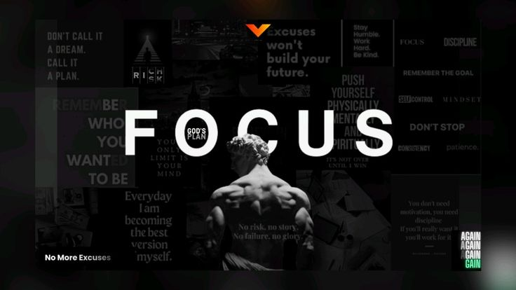

<div align="center">




</div>

<br/>

> **Don't call it a dream. Call it a plan.**
> The sky is the dream. Focus is how you build the runway.



## 01 · Mission Briefing

<div align="center">



</div>

<br/>

Look at the sky long enough and you realize it never stands still: clouds move, light changes, nothing stays the same for two minutes. That's how I want to work and grow too.

The photo above is my compass. **FOCUS** is what turns a big, open sky into a direction, and a direction into daily progress.

**Flight checklist**

- [x] Stay curious about everything new
- [x] Stay focused on the goal, not the excuses
- [x] Keep shipping, even small commits
- [ ] Stop learning *(not in the flight plan)*


## 02 · Pilot Profile

```bash
ozan@sky:~$ whoami
Muhamad Fauzan Pratama   # alias: Ozan

ozan@sky:~$ cat about.txt
Student at SMK Plus Pelita Nusantara
Junior Game Developer & Web Developer
Curious by default. Always learning. Always moving forward.

ozan@sky:~$ ./status.sh
> learning    : Node.js, Tailwind CSS
> building    : games (Unity / C#) and web apps (Laravel, TypeScript)
> open to     : collaborations, projects, new challenges
> bug policy  : every bug is a boss fight
```

### Who's behind the keyboard

I'm someone who genuinely **enjoys learning new things**, and technology is where that curiosity lives the most. A new framework, a new tool, a new way of solving an old problem: it all feels like another patch of sky to explore.

I don't like standing still. When one project lands, I'm already asking *"what can I learn next?"* and *"how do I get better at this?"* Progress doesn't have to be loud. It just has to be **consistent**, and it has to keep **moving forward**.


## 03 · Atmosphere Layers

*My skills, mapped by altitude. The higher the layer, the newer the territory.*

<table>
  <tr>
    <td width="170"><b>🌤️ Troposphere</b><br/><sub>Foundation I build with</sub></td>
    <td></td>
  </tr>
  <tr>
    <td><b>⛅ Stratosphere</b><br/><sub>Climbing right now</sub></td>
    <td></td>
  </tr>
  <tr>
    <td><b>🌌 Space</b><br/><sub>Next horizon</sub></td>
    <td></td>
  </tr>
  <tr>
    <td><b>🧰 Cockpit tools</b><br/><sub>Where I design and code</sub></td>
    <td></td>
  </tr>
</table>


## 04 · Flight Log

<div align="center">


</div>


## 05 · Contact Tower

Got a project, an idea, or just want to build something together? Radio in.

| | |
|:--|:--|
| ✉️ **Email** | [ozan@synchronizeteams.com](mailto:ozan@synchronizeteams.com) · [muhammadfauzanpratama420@gmail.com](mailto:muhammadfauzanpratama420@gmail.com) |
| 💼 **LinkedIn** | [muhammad-fauzan-pratama](https://www.linkedin.com/in/muhammad-fauzan-pratama-776468365/) |
| 📸 **Instagram** | [@zan_2_you](https://www.instagram.com/zan_2_you/) |
| 📺 **YouTube** | [Muhammad Fauzan Pratama](https://www.youtube.com/@muhammadfauzanpratama4356) |
| 💬 **Discord** | [Join me](https://discord.gg/invitekamu) <!-- TODO: replace with your real invite link --> |

<br/>

<div align="center">


**Eyes on the sky. Hands on the keyboard.** ✨


</div>